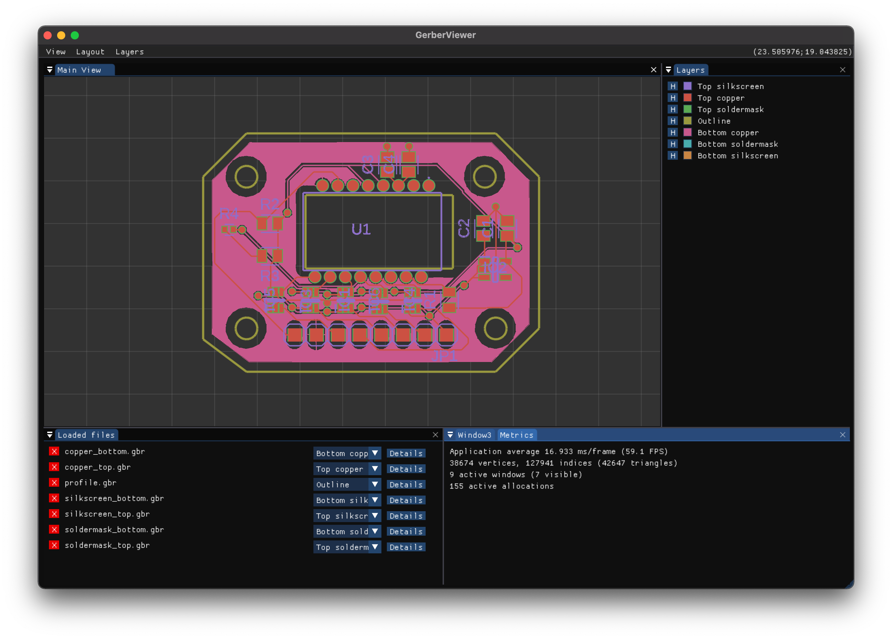

# GerberViewer

GerberViewer is a viewer for gerber files written in C++ using imGUI library for UI. 

# Features

 - file import
	 - parsed as per [The Gerber Layer Format Specification](https://www.ucamco.com/en/gerber)
		 - [x] Comments
		 - [x] mm/inch mode
		 - [x] Format specification
		 - [x] Aparature definition
		 - [ ] Aparature macro
		 - [x] Interpolate operation
		 - [x] Move operation
		 - [x] Flash operation
		 - [x] Modes
			 - [x] Linear
			 - [x] Circular
		 - [ ] Transformation parameters
		 - [x] Region statement
		 - [ ] Aparature block
		 - [x] Polarity
		 - [ ] Step and repeat 
		 - [ ] Attributes
 - delete imported file
 - assign layer to each file
 - rendering
	 - [x] high performance
	 - [x] polarity and order correct
 - change layer order and color
 - zoom and move the displayed file
 - customizable window layout with ability to reset to default
 - toggle displayed grid
 - cursor position in canvas display

# Controls

 - Import file by Drag&Drop into the window - both files and directories supported
 - Move within canvas by dragging with right mouse button pressed
 - Zoom within canvas with scrool wheel
 - Change file layer in Loaded files window
 - Show/Hide layers in Layers window
 - Change Layer color
